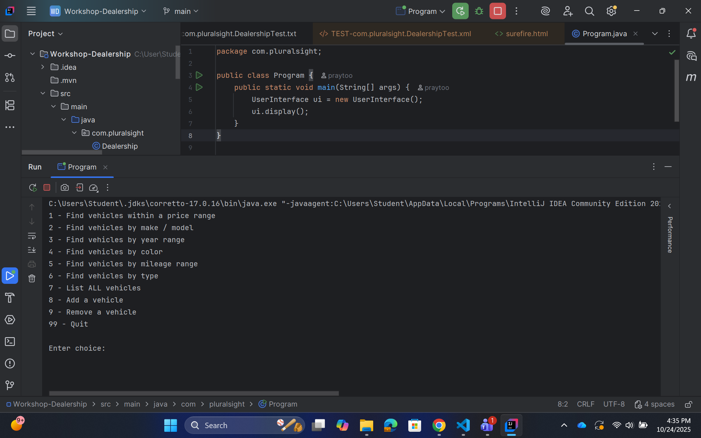
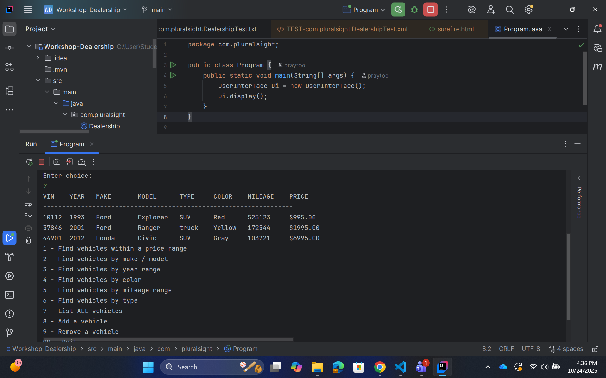
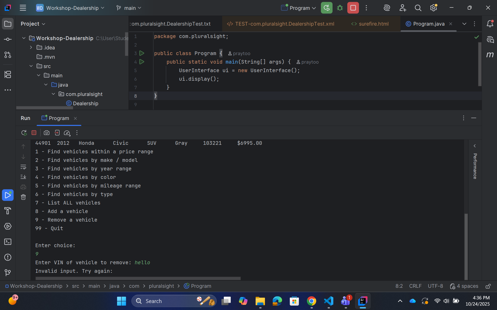
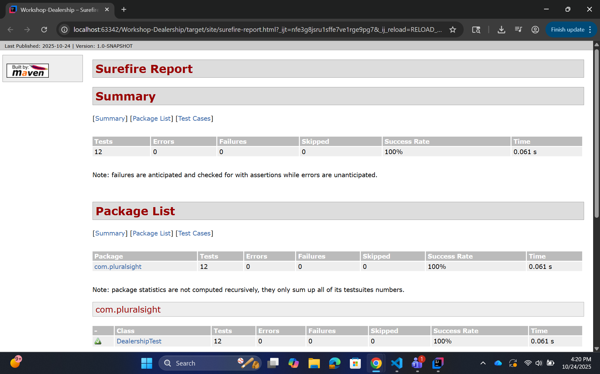
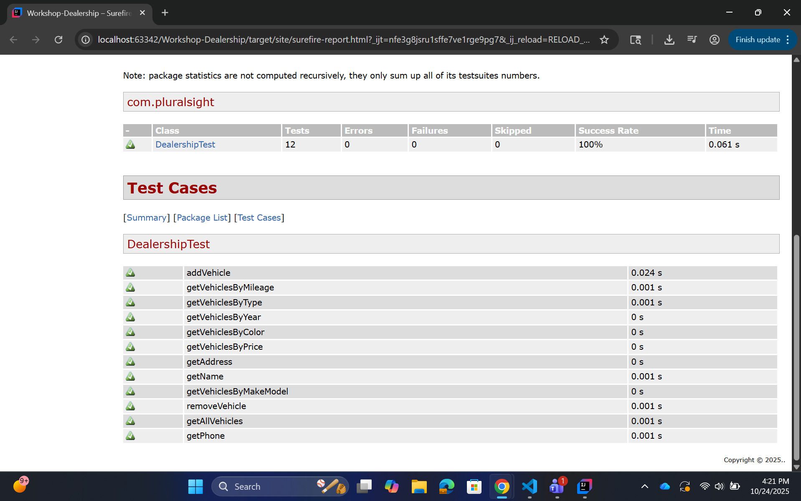

# 🚗 Car Dealership Console App

A mini console-based dealership management app.
Users can search vehicles by price, make/model, year, color, mileage, or type — plus add or remove vehicles.
Data is stored in a simple `inventory.csv` file.

---

## 📚 Table of Contents
- [Features](#features)
- [How It Works](#how-it-works)
- [Class Diagram Overview](#class-diagram-overview)
- [Example inventory.csv](#example-inventorycsv)
- [Run Instructions](#run-instructions)
- [Screenshots](#screenshots)
- [Interesting Code Snippet](#interesting-code-snippet)
- [Test Reports](#test-reports)
- [Tech Stack](#-tech-stack)
- [Author](#author)

---

## 🧠 Features
- 🔍 Find vehicles by price, make/model, year, color, mileage, or type
- 📋 List all vehicles
- ➕ Add a new vehicle
- ➖ Remove a vehicle
- 💾 File persistence — all changes saved automatically

---

## ⚙️ How It Works
1. When the app starts, it loads data from `inventory.csv`.
2. The `UserInterface` displays a console menu.
3. The user selects an option, inputs criteria, and results appear instantly.
4. Adding/removing vehicles automatically rewrites the file.

---

## 🧩 Class Diagram Overview
```
| Class | Responsibility |
|-------|----------------|
| `Vehicle` | Represents one vehicle record |
| `Dealership` | Holds dealership info + list of vehicles |
| `DealershipFileManager` | Reads/writes data from/to the file |
| `UserInterface` | Handles user interaction + menu logic |
| `Program` | Application entry point |
```
---

## 📂 Example inventory.csv
```
D & B Used Cars|111 Old Benbrook Rd|817-555-5555
10112|1993|Ford|Explorer|SUV|Red|525123|995.00
37846|2001|Ford|Ranger|Truck|Yellow|172544|1995.00
44901|2012|Honda|Civic|SUV|Gray|103221|6995.00
```

---

## ▶️ Run Instructions
1. Clone the repo
   ```bash
   git clone https://github.com/praytoo/car-dealership.git
   cd car-dealership
---

## 🖼️ Screenshots
Homescreen:

Vehicle Display:

Failed Input:


---

## 💡 Interesting Code Snippet
```
public ArrayList<Vehicle> getVehiclesByPrice(double min, double max) {
    ArrayList<Vehicle> results = new ArrayList<>();
    for (Vehicle v : inventory) {
        if (v.getPrice() >= min && v.getPrice() <= max) results.add(v);
    }
    return results;
}
```
Why it's interesting:
It uses simple yet effective filtering logic to dynamically search vehicles by price range.

---

## 🧪 Test Reports



---
## 🧰 Tech Stack
- Java 17 ☕
- Maven 3.9+
- JUnit 5 (for testing)
- IntelliJ IDEA (development)
---

## 👨‍💻 Author

Prince Haywood
📍 Playa Vista, California